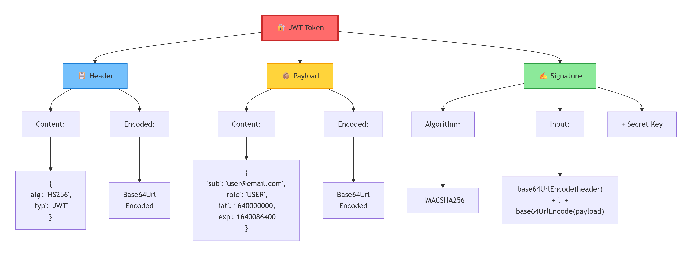

# 🔐 Spring Security — Complete Notes

> **Who is this for?** Java developers who are new to Spring Security and want to understand it from scratch — no jargon, no confusion, just plain English with real-life analogies.

---

## 📚 Table of Contents

1. [What is Spring Security?](#1-what-is-spring-security)
2. [Why Do We Need It?](#2-why-do-we-need-it)
3. [Core Concepts (The Big Picture)](#3-core-concepts-the-big-picture)
4. [How Spring Security Works Internally](#4-how-spring-security-works-internally)
5. [Setting Up Spring Security](#5-setting-up-spring-security)
6. [Authentication](#6-authentication)
7. [Authorization](#7-authorization)
8. [Security Configuration (Java-Based)](#8-security-configuration-java-based)
9. [UserDetailsService & UserDetails](#9-userdetailsservice--userdetails)
10. [Password Encoding](#10-password-encoding)
11. [In-Memory Authentication](#11-in-memory-authentication)
12. [Database Authentication (JDBC)](#12-database-authentication-jdbc)
13. [Custom Login Page](#13-custom-login-page)
14. [Session Management](#14-session-management)
15. [Remember Me](#15-remember-me)
16. [CSRF Protection](#16-csrf-protection)
17. [CORS](#17-cors)
18. [Method-Level Security](#18-method-level-security)
19. [JWT (JSON Web Token) Authentication](#19-jwt-json-web-token-authentication)
20. [OAuth2 & Social Login](#20-oauth2--social-login)
21. [Role vs Authority vs Permission](#21-role-vs-authority-vs-permission)
22. [Exception Handling in Security](#22-exception-handling-in-security)
23. [Security Filters Reference](#23-security-filters-reference)
24. [Common Interview Questions](#24-common-interview-questions)
25. [Quick Revision Cheat Sheet](#25-quick-revision-cheat-sheet)

---

## 1. What is Spring Security?

**Simple Definition:**  
Spring Security is a powerful framework that handles **security** for your Java/Spring application. It helps you answer two fundamental questions:

- 🙋 **Who are you?** → *Authentication*
- 🚪 **What are you allowed to do?** → *Authorization*

**Real-Life Analogy 🏢:**  
Think of a corporate office building:
- The **security guard at the entrance** checks your ID card → *Authentication*
- Once inside, your **access card** only opens certain doors (not the CEO's room) → *Authorization*

Spring Security is that entire security system for your application.

---

## 2. Why Do We Need It?

Without security, your web application would be like a house with **no locks**. Anyone could:
- Access admin pages without logging in
- Steal user data
- Perform actions they shouldn't (delete records, transfer money, etc.)
- Attack via CSRF, XSS, session hijacking, etc.

Spring Security protects against all of this **out of the box**.

---

## 3. Core Concepts (The Big Picture)

| Concept | Simple Meaning | Analogy |
|---|---|---|
| **Authentication** | Verifying WHO you are | Showing your ID at the door |
| **Authorization** | Verifying WHAT you can do | Your ID card's access level |
| **Principal** | The currently logged-in user | The person holding the ID |
| **Credentials** | Proof of identity (password) | The password on your ID |
| **GrantedAuthority** | A permission or role given to user | The access zones on your badge |
| **SecurityContext** | Stores the logged-in user's details | The guard's logbook for your shift |
| **Filter Chain** | A series of security checks | Multiple checkpoints at an airport |

---

## 4. How Spring Security Works Internally

This is the most important section to understand before diving into code.

### The Filter Chain 🔗

When a request comes into your Spring Boot application, it doesn't go **directly** to your controller. It passes through a **chain of security filters** first — like going through multiple security checkpoints at an airport.

```
Incoming HTTP Request
        ↓
+---------------------------+
|  Filter 1: CSRF Check     |
+---------------------------+
        ↓
+---------------------------+
|  Filter 2: Session Check  |
+---------------------------+
        ↓
+---------------------------+
|  Filter 3: Auth Check     |
+---------------------------+
        ↓
  Your Controller (if all checks pass ✅)
```

### The SecurityContextHolder 🗄️

**Analogy:** Imagine a locker room where the security guard stores a note saying *"John is logged in and has ADMIN access."* For the entire duration of John's session, this note is kept safe and referred to whenever needed.

The `SecurityContextHolder` is that locker room. It stores the `SecurityContext`, which holds the `Authentication` object (details about the logged-in user).

```
SecurityContextHolder
    └── SecurityContext
            └── Authentication
                    ├── Principal (the user object)
                    ├── Credentials (password — cleared after login)
                    └── GrantedAuthorities (roles/permissions)
```

### Full Request Flow Diagram

```
Browser Request (e.g., GET /admin)
        ↓
[Spring Security Filter Chain]
        ↓
UsernamePasswordAuthenticationFilter (if login request)
        ↓
AuthenticationManager
        ↓
AuthenticationProvider
        ↓
UserDetailsService (loads user from DB)
        ↓
PasswordEncoder (validates password)
        ↓
SecurityContextHolder (stores Authentication)
        ↓
Authorization Check (can this user access /admin?)
        ↓
Your Controller / AccessDeniedException
```

---

## 5. Setting Up Spring Security

### Step 1 — Add Dependency

**Maven (`pom.xml`):**
```xml
<dependency>
    <groupId>org.springframework.boot</groupId>
    <artifactId>spring-boot-starter-security</artifactId>
</dependency>
```

**Gradle (`build.gradle`):**
```groovy
implementation 'org.springframework.boot:spring-boot-starter-security'
```

### What Happens Immediately After Adding the Dependency?

Spring Boot **auto-configures** Spring Security. Without writing a single line of code:

1. ✅ All endpoints are **locked** (require login)
2. ✅ A **default login page** is provided at `/login`
3. ✅ A default user is created:
   - **Username:** `user`
   - **Password:** Printed in console (e.g., `Using generated security password: 3b4c5d6e...`)
4. ✅ `/logout` endpoint is auto-configured

> **Note:** This default behavior is great for quick starts but must be customized for real applications.

---

## 6. Authentication

**Authentication = Proving your identity.**

### How Authentication Works (Step by Step)

1. User submits login form (username + password)
2. Spring Security creates an `Authentication` object with these credentials
3. It passes this to the `AuthenticationManager`
4. `AuthenticationManager` delegates to an `AuthenticationProvider`
5. The provider calls `UserDetailsService` to load user from the database
6. It compares passwords using `PasswordEncoder`
7. If valid → returns a fully authenticated `Authentication` object
8. Spring stores this in `SecurityContextHolder`

### Key Classes

| Class/Interface | Role |
|---|---|
| `Authentication` | Holds user info (principal, credentials, authorities) |
| `AuthenticationManager` | Entry point for authentication — delegates to providers |
| `ProviderManager` | Default implementation of `AuthenticationManager` |
| `AuthenticationProvider` | Does the actual authentication logic |
| `DaoAuthenticationProvider` | Authenticates using a `UserDetailsService` |
| `UserDetailsService` | Loads user from a database |
| `UserDetails` | Represents the user object |

---

## 7. Authorization

**Authorization = What are you allowed to do after logging in?**

**Analogy 🎢:** At an amusement park, you've shown your ticket (authenticated). But some rides require a "VIP pass" (authorized). Your regular ticket doesn't get you on those rides.

### Types of Authorization

1. **URL-Based Authorization** — Restrict access to specific URLs
2. **Method-Level Authorization** — Restrict access to specific methods in your code

### URL-Based Authorization (in Security Config)

```java
http.authorizeHttpRequests(auth -> auth
    .requestMatchers("/public/**").permitAll()         // Anyone can access
    .requestMatchers("/admin/**").hasRole("ADMIN")     // Only ADMIN
    .requestMatchers("/user/**").hasRole("USER")       // Only USER
    .anyRequest().authenticated()                       // Others need login
);
```

---

## 8. Security Configuration (Java-Based)

In modern Spring Security (5.7+), you create a configuration class using `@Configuration` and `@EnableWebSecurity`.

> **Note:** The old way used `WebSecurityConfigurerAdapter` (now deprecated). The new way uses `SecurityFilterChain` as a bean.

### Modern Security Config Template

```java
import org.springframework.context.annotation.Bean;
import org.springframework.context.annotation.Configuration;
import org.springframework.security.config.annotation.web.builders.HttpSecurity;
import org.springframework.security.config.annotation.web.configuration.EnableWebSecurity;
import org.springframework.security.web.SecurityFilterChain;

@Configuration
@EnableWebSecurity
public class SecurityConfig {

    @Bean
    public SecurityFilterChain securityFilterChain(HttpSecurity http) throws Exception {

        http
            // 1. Authorization rules
            .authorizeHttpRequests(auth -> auth
                .requestMatchers("/", "/home", "/public/**").permitAll()
                .requestMatchers("/admin/**").hasRole("ADMIN")
                .anyRequest().authenticated()
            )

            // 2. Login configuration
            .formLogin(form -> form
                .loginPage("/login")          // Your custom login page
                .defaultSuccessUrl("/dashboard")
                .permitAll()
            )

            // 3. Logout configuration
            .logout(logout -> logout
                .logoutUrl("/logout")
                .logoutSuccessUrl("/login?logout")
                .permitAll()
            );

        return http.build();
    }
}
```

### Breaking Down the Config

| Section | What It Does |
|---|---|
| `authorizeHttpRequests` | Defines who can access which URLs |
| `formLogin` | Enables and customizes the login form |
| `logout` | Configures logout behavior |
| `csrf` | CSRF protection (enabled by default) |
| `sessionManagement` | Controls session behavior |
| `httpBasic` | Enables HTTP Basic auth (for APIs) |

---

## 9. UserDetailsService & UserDetails

These are the two most important interfaces you'll implement when using database authentication.

### UserDetails Interface

**Analogy:** Think of `UserDetails` as the **employee badge** that Spring Security reads. It contains all info about the user.

```java
public interface UserDetails extends Serializable {
    Collection<? extends GrantedAuthority> getAuthorities(); // roles/permissions
    String getPassword();
    String getUsername();
    boolean isAccountNonExpired();      // Is account expired?
    boolean isAccountNonLocked();       // Is account locked?
    boolean isCredentialsNonExpired();  // Is password expired?
    boolean isEnabled();                // Is account active?
}
```

### Implementing UserDetails

```java
import org.springframework.security.core.GrantedAuthority;
import org.springframework.security.core.authority.SimpleGrantedAuthority;
import org.springframework.security.core.userdetails.UserDetails;
import java.util.Collection;
import java.util.List;

public class CustomUserDetails implements UserDetails {

    private final User user; // Your DB entity

    public CustomUserDetails(User user) {
        this.user = user;
    }

    @Override
    public Collection<? extends GrantedAuthority> getAuthorities() {
        // Convert user's role to a GrantedAuthority
        return List.of(new SimpleGrantedAuthority("ROLE_" + user.getRole()));
    }

    @Override
    public String getPassword() { return user.getPassword(); }

    @Override
    public String getUsername() { return user.getEmail(); }

    @Override
    public boolean isAccountNonExpired() { return true; }

    @Override
    public boolean isAccountNonLocked() { return true; }

    @Override
    public boolean isCredentialsNonExpired() { return true; }

    @Override
    public boolean isEnabled() { return user.isActive(); }
}
```

### UserDetailsService Interface

This is the service that **loads user data from your database**.

```java
public interface UserDetailsService {
    UserDetails loadUserByUsername(String username) throws UsernameNotFoundException;
}
```

### Implementing UserDetailsService

```java
import org.springframework.security.core.userdetails.UserDetails;
import org.springframework.security.core.userdetails.UserDetailsService;
import org.springframework.security.core.userdetails.UsernameNotFoundException;
import org.springframework.stereotype.Service;

@Service
public class CustomUserDetailsService implements UserDetailsService {

    private final UserRepository userRepository;

    public CustomUserDetailsService(UserRepository userRepository) {
        this.userRepository = userRepository;
    }

    @Override
    public UserDetails loadUserByUsername(String username) throws UsernameNotFoundException {
        // Load user from database
        User user = userRepository.findByEmail(username)
            .orElseThrow(() -> new UsernameNotFoundException("User not found: " + username));

        return new CustomUserDetails(user);
    }
}
```

---

## 10. Password Encoding

**Never store plain-text passwords.** This is a golden rule of security.

**Analogy 🔒:** Storing a plain-text password is like writing your house key pattern on a sticky note and pasting it on your front door. Anyone who sees it can make a copy.

Spring Security uses `PasswordEncoder` to hash passwords before storing them and to verify them during login.

### BCryptPasswordEncoder (Most Common)

BCrypt is the recommended password encoder. It automatically includes a **salt** (random data) to make each hash unique, even for the same password.

```java
@Bean
public PasswordEncoder passwordEncoder() {
    return new BCryptPasswordEncoder();
}
```

### Using the Encoder

```java
// When registering a user (save hashed password):
String rawPassword = "myPassword123";
String hashedPassword = passwordEncoder.encode(rawPassword);
user.setPassword(hashedPassword);
userRepository.save(user);

// Verification is done automatically by Spring Security during login
// But manually you can do:
boolean matches = passwordEncoder.matches(rawPassword, hashedPassword); // true
```

### Password Encoders Comparison

| Encoder | Security Level | Notes |
|---|---|---|
| `BCryptPasswordEncoder` | ⭐⭐⭐⭐⭐ | Best choice for most apps |
| `Pbkdf2PasswordEncoder` | ⭐⭐⭐⭐ | Good alternative |
| `Argon2PasswordEncoder` | ⭐⭐⭐⭐⭐ | Modern, memory-hard |
| `NoOpPasswordEncoder` | ❌ | NEVER use in production |

---

## 11. In-Memory Authentication

Useful for **quick testing or small apps** where you don't need a database.

```java
@Bean
public UserDetailsService userDetailsService(PasswordEncoder encoder) {
    UserDetails admin = User.builder()
        .username("admin")
        .password(encoder.encode("admin123"))
        .roles("ADMIN")
        .build();

    UserDetails user = User.builder()
        .username("john")
        .password(encoder.encode("john123"))
        .roles("USER")
        .build();

    return new InMemoryUserDetailsManager(admin, user);
}
```

> ⚠️ Users created here are **lost when the app restarts**. Use database authentication for real apps.

---

## 12. Database Authentication (JDBC)

### Your User Entity

```java
@Entity
@Table(name = "users")
public class User {
    @Id
    @GeneratedValue(strategy = GenerationType.IDENTITY)
    private Long id;

    private String name;
    private String email;       // Used as username
    private String password;    // BCrypt hashed
    private String role;        // e.g., "ADMIN" or "USER"
    private boolean active;

    // Getters and Setters...
}
```

### Your Repository

```java
@Repository
public interface UserRepository extends JpaRepository<User, Long> {
    Optional<User> findByEmail(String email);
}
```

### Wiring Everything Together

```java
@Configuration
@EnableWebSecurity
public class SecurityConfig {

    private final CustomUserDetailsService userDetailsService;

    public SecurityConfig(CustomUserDetailsService userDetailsService) {
        this.userDetailsService = userDetailsService;
    }

    @Bean
    public SecurityFilterChain filterChain(HttpSecurity http) throws Exception {
        http
            .authorizeHttpRequests(auth -> auth
                .requestMatchers("/register", "/login").permitAll()
                .requestMatchers("/admin/**").hasRole("ADMIN")
                .anyRequest().authenticated()
            )
            .formLogin(form -> form
                .loginPage("/login")
                .loginProcessingUrl("/login")     // Form posts to this URL
                .defaultSuccessUrl("/home", true)
                .failureUrl("/login?error=true")
                .permitAll()
            )
            .logout(logout -> logout
                .logoutSuccessUrl("/login?logout")
            );

        return http.build();
    }

    @Bean
    public PasswordEncoder passwordEncoder() {
        return new BCryptPasswordEncoder();
    }

    @Bean
    public AuthenticationProvider authenticationProvider() {
        DaoAuthenticationProvider provider = new DaoAuthenticationProvider();
        provider.setUserDetailsService(userDetailsService);
        provider.setPasswordEncoder(passwordEncoder());
        return provider;
    }
}
```

---

## 13. Custom Login Page

### Controller

```java
@Controller
public class AuthController {

    @GetMapping("/login")
    public String loginPage() {
        return "login"; // Thymeleaf template: login.html
    }

    @GetMapping("/home")
    public String home() {
        return "home";
    }
}
```

### Thymeleaf Login Template (`login.html`)

```html
<!DOCTYPE html>
<html xmlns:th="http://www.thymeleaf.org">
<head>
    <title>Login</title>
</head>
<body>
    <h2>Login</h2>

    <!-- Show error message -->
    <div th:if="${param.error}" style="color:red">
        Invalid username or password!
    </div>

    <!-- Show logout message -->
    <div th:if="${param.logout}" style="color:green">
        You have been logged out.
    </div>

    <!--
        IMPORTANT: action="/login" must match loginProcessingUrl in config
        Spring Security handles the POST automatically
    -->
    <form th:action="@{/login}" method="post">
        <!-- CSRF token is auto-added by Thymeleaf -->
        <label>Username: <input type="text" name="username"/></label><br/>
        <label>Password: <input type="password" name="password"/></label><br/>
        <button type="submit">Login</button>
    </form>
</body>
</html>
```

> **Key Point:** The form input names **must** be `username` and `password` (Spring Security defaults). You can change them with `.usernameParameter("email")` in config.

---

## 14. Session Management

**Analogy 🎟️:** When you log into a website, the server gives you a **session ticket** (like a wristband at an amusement park). Every request you make, you show this wristband. The server doesn't need to verify your identity every single time.

### Session Fixation Protection

Spring Security automatically protects against session fixation attacks (where attackers try to hijack your session ID).

```java
http.sessionManagement(session -> session
    .sessionFixation().migrateSession()  // Default: creates new session on login
);
```

### Concurrent Session Control

Prevent users from logging in from multiple places at once:

```java
http.sessionManagement(session -> session
    .maximumSessions(1)                         // Only 1 session per user
    .maxSessionsPreventsLogin(true)             // Block new login if session exists
    // OR
    .expiredUrl("/login?sessionExpired=true")   // Expire old session, allow new login
);
```

### Session Timeout

In `application.properties`:
```properties
# Session expires after 30 minutes of inactivity
server.servlet.session.timeout=30m
```

---

## 15. Remember Me

**Analogy:** "Remember Me" is like a post-it note the website keeps about you. Even after you close the browser, the website remembers you were logged in (up to a set duration).

### How It Works Internally

1. On login with "Remember Me" checked, Spring creates a special **token**
2. This token is stored in a **cookie** in your browser
3. Next visit, Spring reads the cookie, verifies the token, and logs you in automatically

### Simple Token-Based Remember Me

```java
http.rememberMe(remember -> remember
    .key("uniqueAndSecret")         // Secret key to sign tokens
    .tokenValiditySeconds(604800)   // 7 days = 7 * 24 * 60 * 60
    .rememberMeParameter("remember-me") // HTML checkbox name
);
```

### In Your Login HTML

```html
<input type="checkbox" name="remember-me"/> Remember Me
```

### Persistent (DB-Based) Remember Me

More secure — stores tokens in database:

```java
http.rememberMe(remember -> remember
    .tokenRepository(persistentTokenRepository())
    .tokenValiditySeconds(604800)
);

@Bean
public PersistentTokenRepository persistentTokenRepository() {
    JdbcTokenRepositoryImpl repo = new JdbcTokenRepositoryImpl();
    repo.setDataSource(dataSource);
    repo.setCreateTableOnStartup(true); // Creates 'persistent_logins' table
    return repo;
}
```

---

## 16. CSRF Protection

### What is CSRF?

**CSRF = Cross-Site Request Forgery**

**Analogy 🎭:** Imagine you're logged into your bank. A hacker sends you an email with a link. When you click it, your browser secretly sends a request to your bank (using your session) to transfer money to the hacker. You didn't initiate it — your browser was tricked.

CSRF attacks exploit the fact that browsers **automatically send cookies** (including session cookies) with requests.

### How Spring Security Prevents CSRF

Spring generates a **unique CSRF token** for each session. Every form submission must include this token. The server verifies it. Since a hacker's site doesn't know this token, the fake request fails.

### CSRF with Thymeleaf (Auto)

Thymeleaf automatically includes the CSRF token in forms:
```html
<form th:action="@{/submit}" method="post">
    <!-- Thymeleaf auto-adds: -->
    <!-- <input type="hidden" name="_csrf" value="abc123..."/> -->
</form>
```

### CSRF with Plain HTML

```html
<form action="/submit" method="post">
    <input type="hidden" th:name="${_csrf.parameterName}" th:value="${_csrf.token}"/>
    <!-- form fields -->
</form>
```

### Disabling CSRF (for REST APIs)

REST APIs that use JWT tokens (stateless) don't need CSRF protection because they don't use cookies for authentication.

```java
http.csrf(csrf -> csrf.disable()); // Safe ONLY for stateless REST APIs
```

> ⚠️ **Never disable CSRF for traditional web apps** that use session-based authentication.

---

## 17. CORS

### What is CORS?

**CORS = Cross-Origin Resource Sharing**

**Analogy 🌐:** Your frontend runs at `http://frontend.com` and your backend at `http://api.com`. Browsers are suspicious of requests going to a different "origin" (domain/port). CORS is a way for the **server to say "Yes, I trust requests from frontend.com"**.

### Configuring CORS in Spring Security

```java
@Bean
public SecurityFilterChain filterChain(HttpSecurity http) throws Exception {
    http
        .cors(cors -> cors.configurationSource(corsConfigurationSource()))
        .csrf(csrf -> csrf.disable())
        // ...rest of config
        ;
    return http.build();
}

@Bean
public CorsConfigurationSource corsConfigurationSource() {
    CorsConfiguration config = new CorsConfiguration();

    config.setAllowedOrigins(List.of("http://localhost:3000", "https://myfrontend.com"));
    config.setAllowedMethods(List.of("GET", "POST", "PUT", "DELETE", "OPTIONS"));
    config.setAllowedHeaders(List.of("*"));
    config.setAllowCredentials(true); // Allow cookies/auth headers

    UrlBasedCorsConfigurationSource source = new UrlBasedCorsConfigurationSource();
    source.registerCorsConfiguration("/**", config); // Apply to all endpoints
    return source;
}
```

---

## 18. Method-Level Security

Instead of (or in addition to) URL-based security, you can secure **individual methods** in your service layer.

### Enable Method Security

```java
@Configuration
@EnableMethodSecurity // Enables @PreAuthorize, @PostAuthorize, etc.
public class SecurityConfig {
    // ...
}
```

### @PreAuthorize

Checks permission **before** the method runs.

```java
@Service
public class ProductService {

    // Only ADMIN can delete products
    @PreAuthorize("hasRole('ADMIN')")
    public void deleteProduct(Long id) {
        productRepository.deleteById(id);
    }

    // Any authenticated user can view products
    @PreAuthorize("isAuthenticated()")
    public List<Product> getAllProducts() {
        return productRepository.findAll();
    }

    // User can only access their own data
    @PreAuthorize("#userId == authentication.principal.id")
    public User getUserData(Long userId) {
        return userRepository.findById(userId).orElseThrow();
    }

    // Multiple conditions
    @PreAuthorize("hasRole('ADMIN') or hasRole('MANAGER')")
    public void updateProduct(Product product) {
        productRepository.save(product);
    }
}
```

### @PostAuthorize

Checks permission **after** the method runs (can inspect the return value):

```java
// Only return the order if it belongs to the current user
@PostAuthorize("returnObject.username == authentication.name")
public Order getOrder(Long orderId) {
    return orderRepository.findById(orderId).orElseThrow();
}
```

### @Secured

Simpler, older annotation:

```java
@Secured("ROLE_ADMIN")
public void adminOnlyMethod() { ... }

@Secured({"ROLE_ADMIN", "ROLE_MANAGER"})
public void adminOrManagerMethod() { ... }
```

### SpEL Expressions in @PreAuthorize

| Expression | Meaning |
|---|---|
| `hasRole('ADMIN')` | User has ROLE_ADMIN |
| `hasAnyRole('ADMIN', 'USER')` | User has any of these roles |
| `hasAuthority('READ_PRIVILEGE')` | User has specific authority |
| `isAuthenticated()` | User is logged in |
| `isAnonymous()` | User is NOT logged in |
| `permitAll()` | Everyone allowed |
| `denyAll()` | No one allowed |
| `authentication.name` | Current user's username |
| `#paramName` | Method parameter value |

---

## 19. JWT (JSON Web Token) Authentication

JWT is used for **stateless authentication** — mainly in REST APIs.

**Analogy 🎫:** Instead of giving you a locker (session), the server gives you a **self-contained ticket** (JWT) that has all your info printed on it. You carry the ticket everywhere. The server just reads it — no need to remember anything.

### How JWT Works

```
1. User logs in with username + password
2. Server verifies credentials
3. Server creates a JWT token (signed with a secret key)
4. Server sends the token to the client
5. Client stores it (localStorage or memory)
6. Client sends token in every request: Authorization: Bearer <token>
7. Server verifies the token signature and reads the user info
8. No session, no cookie, no server-side state
```


### JWT AUTHENTICATION FLOW 

```
┌─────────────────────────────────────────────────────────────────┐
│                        JWT AUTHENTICATION FLOW                   │
└─────────────────────────────────────────────────────────────────┘

    CLIENT                    SERVER                    DATABASE
       │                         │                          │
       │   1. POST /login         │                          │
       │   {email, password}      │                          │
       ├────────────────────────>│                          │
       │                         │                          │
       │                         │   2. findByEmail()       │
       │                         ├─────────────────────────>│
       │                         │                          │
       │                         │   3. User Object         │
       │                         │<─────────────────────────┤
       │                         │                          │
       │                         │   4. Verify Password     │
       │                         │   (BCrypt)               │
       │                         │                          │
       │   5. JWT Token           │                          │
       │<────────────────────────┤                          │
       │                         │                          │
       │   6. Store Token         │                          │
       │   (LocalStorage/Cookie)  │                          │
       │                         │                          │
       │   7. GET /api/data       │                          │
       │   Authorization: Bearer  │                          │
       ├────────────────────────>│                          │
       │                         │                          │
       │                         │   8. Validate JWT        │
       │                         │   - Check Signature      │
       │                         │   - Check Expiration     │
       │                         │   - Extract User         │
       │                         │                          │
       │   9. Response Data       │                          │
       │<────────────────────────┤                          │
       │                         │                          │

┌─────────────────────────────────────────────────────────────────┐
│                    JWT TOKEN STRUCTURE                          │
├─────────────────────────────────────────────────────────────────┤
│                                                                  │
│   HEADER.PAYLOAD.SIGNATURE                                       │
│                                                                  │
│   ┌──────────┐ ┌─────────────────┐ ┌──────────────────────┐    │
│   │ Header   │.│ Payload         │.│ Signature            │    │
│   ├──────────┤ ├─────────────────┤ ├──────────────────────┤    │
│   │ Algorithm│ │ User ID         │ │ HMACSHA256(          │    │
│   │ Token Type│ │ Email           │ │   header + "." +     │    │
│   └──────────┘ │ Role            │ │   payload,           │    │
│                │ Issued At        │ │   secret             │    │
│                │ Expiration       │ │ )                    │    │
│                └─────────────────┘ └──────────────────────┘    │
│                                                                  │
└─────────────────────────────────────────────────────────────────┘
```


### JWT Structure

A JWT has 3 parts separated by dots: `header.payload.signature`



```
┌─────────────────────────────────────────────────────────────────────────────────────┐
│                              JWT TOKEN STRUCTURE                                     │
│                        "The Magic Wristband"                                         │
└─────────────────────────────────────────────────────────────────────────────────────┘

    COMPLETE JWT TOKEN:
    ┌─────────────────────────────────────────────────────────────────────────────┐
    │  eyJhbGciOiJIUzI1NiIsInR5cCI6IkpXVCJ9.                                      │
    │  eyJzdWIiOiJqb2huQGV4YW1wbGUuY29tIiwicm9sZSI6IlVTRVIiLCJpYXQiOjE2NDAwMDAwMDAs│
    │  ImV4cCI6MTY0MDA4NjQwMH0.                                                   │
    │  SflKxwRJSMeKKF2QT4fwpMeJf36POk6yJV_adQssw5c                                │
    └─────────────────────────────────────────────────────────────────────────────┘
    
    ┌──────────────────┐ ┌────────────────────────┐ ┌─────────────────────────┐
    │     HEADER       │.│       PAYLOAD          │.│      SIGNATURE          │
    │  (What type?)    │ │    (Who are you?)      │ │   (Is it real?)         │
    ├──────────────────┤ ├────────────────────────┤ ├─────────────────────────┤
    │ {                │ │ {                      │ │ HMACSHA256(             │
    │   "alg": "HS256",│ │   "sub": "john@ex.com",│ │   base64UrlEncode(header)│
    │   "typ": "JWT"   │ │   "role": "USER",      │ │   + "." +               │
    │ }                │ │   "iat": 1640000000,   │ │   base64UrlEncode(payload│
    │                  │ │   "exp": 1640086400    │ │   ),                    │
    │                  │ │ }                      │ │   "secret-key"          │
    │                  │ │                        │ │ )                       │
    └──────────────────┘ └────────────────────────┘ └─────────────────────────┘
           │                        │                            │
           │                        │                            │
           ▼                        ▼                            ▼
    ┌──────────────────┐ ┌────────────────────────┐ ┌─────────────────────────┐
    │ Base64Url encoded│ │ Base64Url encoded      │ │ Used to verify          │
    │ Result:          │ │ Result:                │ │ token wasn't tampered   │
    │ eyJhbGciOiJIUzI1 │ │ eyJzdWIiOiJqb2huQGV4   │ │                         │
    │ NiIsInR5cCI6IkpX │ │ YW1wbGUuY29tIiwicm9s   │ │ Can't be decoded to     │
    │ VCJ9             │ │ ZSI6IlVTRVIiLCJpYXQiO │ │ original - only verified│
    └──────────────────┘ └────────────────────────┘ └─────────────────────────┘
```

```
eyJhbGciOiJIUzI1NiJ9     ← Header (algorithm type)
.
eyJzdWIiOiJqb2huQGV4YW1wbGUuY29tIiwicm9sZXMiOiJBRE1JTiJ9  ← Payload (user data)
.
SflKxwRJSMeKKF2QT4fwpMeJf36POk6yJV_adQssw5c     ← Signature (verification)
```

> The header and payload are just **Base64 encoded** (not encrypted — anyone can read them). The **signature** ensures the token hasn't been tampered with.

### Add JWT Dependency

```xml
<dependency>
    <groupId>io.jsonwebtoken</groupId>
    <artifactId>jjwt-api</artifactId>
    <version>0.11.5</version>
</dependency>
<dependency>
    <groupId>io.jsonwebtoken</groupId>
    <artifactId>jjwt-impl</artifactId>
    <version>0.11.5</version>
    <scope>runtime</scope>
</dependency>
<dependency>
    <groupId>io.jsonwebtoken</groupId>
    <artifactId>jjwt-jackson</artifactId>
    <version>0.11.5</version>
    <scope>runtime</scope>
</dependency>
```

### JwtService — Create & Validate Tokens

```java
@Service
public class JwtService {

    private static final String SECRET_KEY = "your-256-bit-secret-key-here-must-be-long";

    // Generate a JWT token for a user
    public String generateToken(UserDetails userDetails) {
        return Jwts.builder()
            .setSubject(userDetails.getUsername())
            .setIssuedAt(new Date())
            .setExpiration(new Date(System.currentTimeMillis() + 1000 * 60 * 60)) // 1 hour
            .signWith(getSigningKey(), SignatureAlgorithm.HS256)
            .compact();
    }

    // Extract username from token
    public String extractUsername(String token) {
        return Jwts.parserBuilder()
            .setSigningKey(getSigningKey())
            .build()
            .parseClaimsJws(token)
            .getBody()
            .getSubject();
    }

    // Check if token is valid
    public boolean isTokenValid(String token, UserDetails userDetails) {
        final String username = extractUsername(token);
        return username.equals(userDetails.getUsername()) && !isTokenExpired(token);
    }

    private boolean isTokenExpired(String token) {
        return Jwts.parserBuilder()
            .setSigningKey(getSigningKey())
            .build()
            .parseClaimsJws(token)
            .getBody()
            .getExpiration()
            .before(new Date());
    }

    private Key getSigningKey() {
        byte[] keyBytes = Decoders.BASE64.decode(SECRET_KEY);
        return Keys.hmacShaKeyFor(keyBytes);
    }
}
```

### JWT Authentication Filter

This filter runs on **every request** and checks for a valid JWT:

```java
@Component
public class JwtAuthenticationFilter extends OncePerRequestFilter {

    private final JwtService jwtService;
    private final UserDetailsService userDetailsService;

    public JwtAuthenticationFilter(JwtService jwtService, UserDetailsService userDetailsService) {
        this.jwtService = jwtService;
        this.userDetailsService = userDetailsService;
    }

    @Override
    protected void doFilterInternal(HttpServletRequest request,
                                    HttpServletResponse response,
                                    FilterChain filterChain) throws ServletException, IOException {

        // 1. Get Authorization header
        String authHeader = request.getHeader("Authorization");

        // 2. Check if it's a Bearer token
        if (authHeader == null || !authHeader.startsWith("Bearer ")) {
            filterChain.doFilter(request, response); // Pass to next filter
            return;
        }

        // 3. Extract the token (remove "Bearer " prefix)
        String jwt = authHeader.substring(7);

        // 4. Extract username from token
        String username = jwtService.extractUsername(jwt);

        // 5. If username is valid and user is not yet authenticated
        if (username != null && SecurityContextHolder.getContext().getAuthentication() == null) {

            UserDetails userDetails = userDetailsService.loadUserByUsername(username);

            // 6. Validate token
            if (jwtService.isTokenValid(jwt, userDetails)) {

                // 7. Set authentication in SecurityContext
                UsernamePasswordAuthenticationToken authToken =
                    new UsernamePasswordAuthenticationToken(
                        userDetails, null, userDetails.getAuthorities()
                    );
                authToken.setDetails(new WebAuthenticationDetailsSource().buildDetails(request));
                SecurityContextHolder.getContext().setAuthentication(authToken);
            }
        }

        // 8. Continue to next filter
        filterChain.doFilter(request, response);
    }
}
```

### Security Config for JWT (Stateless)

```java
@Configuration
@EnableWebSecurity
public class SecurityConfig {

    private final JwtAuthenticationFilter jwtAuthFilter;
    private final UserDetailsService userDetailsService;

    // Constructor injection...

    @Bean
    public SecurityFilterChain filterChain(HttpSecurity http) throws Exception {
        http
            .csrf(csrf -> csrf.disable())           // No CSRF for stateless APIs
            .authorizeHttpRequests(auth -> auth
                .requestMatchers("/api/auth/**").permitAll()  // Login/Register open
                .anyRequest().authenticated()
            )
            .sessionManagement(session -> session
                .sessionCreationPolicy(SessionCreationPolicy.STATELESS) // No sessions!
            )
            .authenticationProvider(authenticationProvider())
            // Add JWT filter BEFORE the default username/password filter
            .addFilterBefore(jwtAuthFilter, UsernamePasswordAuthenticationFilter.class);

        return http.build();
    }

    @Bean
    public AuthenticationProvider authenticationProvider() {
        DaoAuthenticationProvider provider = new DaoAuthenticationProvider();
        provider.setUserDetailsService(userDetailsService);
        provider.setPasswordEncoder(passwordEncoder());
        return provider;
    }

    @Bean
    public AuthenticationManager authenticationManager(AuthenticationConfiguration config)
            throws Exception {
        return config.getAuthenticationManager();
    }

    @Bean
    public PasswordEncoder passwordEncoder() {
        return new BCryptPasswordEncoder();
    }
}
```

### Auth Controller (Login Endpoint)

```java
@RestController
@RequestMapping("/api/auth")
public class AuthController {

    private final AuthenticationManager authenticationManager;
    private final UserDetailsService userDetailsService;
    private final JwtService jwtService;

    // Constructor...

    @PostMapping("/login")
    public ResponseEntity<Map<String, String>> login(@RequestBody LoginRequest request) {

        // This throws an exception if credentials are wrong
        authenticationManager.authenticate(
            new UsernamePasswordAuthenticationToken(request.getUsername(), request.getPassword())
        );

        UserDetails userDetails = userDetailsService.loadUserByUsername(request.getUsername());
        String token = jwtService.generateToken(userDetails);

        return ResponseEntity.ok(Map.of("token", token));
    }
}
```

---

## 20. OAuth2 & Social Login

### What is OAuth2?

**Analogy 🔑:** Instead of creating a new account, you click "Login with Google". Google verifies who you are and tells your app "Yes, this is John, here's some info about him." You never share your Google password with the app.

OAuth2 is a protocol that allows **third-party login** (Google, GitHub, Facebook, etc.)

### Add Dependency

```xml
<dependency>
    <groupId>org.springframework.boot</groupId>
    <artifactId>spring-boot-starter-oauth2-client</artifactId>
</dependency>
```

### Configure in `application.yml`

```yaml
spring:
  security:
    oauth2:
      client:
        registration:
          google:
            client-id: YOUR_GOOGLE_CLIENT_ID
            client-secret: YOUR_GOOGLE_CLIENT_SECRET
            scope: email, profile
          github:
            client-id: YOUR_GITHUB_CLIENT_ID
            client-secret: YOUR_GITHUB_CLIENT_SECRET
```

### Security Config for OAuth2

```java
http
    .oauth2Login(oauth2 -> oauth2
        .loginPage("/login")
        .defaultSuccessUrl("/dashboard")
        .userInfoEndpoint(userInfo -> userInfo
            .userService(customOAuth2UserService) // Optional: custom user handling
        )
    );
```

### OAuth2 Flow

```
1. User clicks "Login with Google"
2. Spring redirects to Google's login page
3. User logs in on Google
4. Google redirects back with an authorization code
5. Spring exchanges code for an access token
6. Spring uses token to fetch user info from Google
7. Spring creates a SecurityContext with the user
8. User is logged in!
```

---

## 21. Role vs Authority vs Permission

This is a common source of confusion. Let's clear it up.

### Role

- A **role** is a group of permissions
- In Spring Security, roles are just authorities with a **`ROLE_` prefix**
- Examples: `ROLE_ADMIN`, `ROLE_USER`, `ROLE_MANAGER`

```java
// These two are equivalent:
hasRole("ADMIN")           // Spring adds ROLE_ prefix automatically
hasAuthority("ROLE_ADMIN") // You provide the full name
```

### Authority

- An **authority** is a fine-grained permission
- Examples: `READ_USERS`, `WRITE_PRODUCTS`, `DELETE_ORDERS`

### Practical Example

```
ROLE_ADMIN has authorities:
  - READ_USERS
  - WRITE_USERS
  - DELETE_USERS
  - READ_PRODUCTS
  - WRITE_PRODUCTS
  - DELETE_PRODUCTS

ROLE_USER has authorities:
  - READ_PRODUCTS
```

### In Code

```java
// Granting authorities
List.of(
    new SimpleGrantedAuthority("ROLE_ADMIN"),
    new SimpleGrantedAuthority("READ_USERS"),
    new SimpleGrantedAuthority("WRITE_PRODUCTS")
)

// Checking in config
.requestMatchers("/admin/**").hasRole("ADMIN")
.requestMatchers("/products/read").hasAuthority("READ_PRODUCTS")

// Checking in @PreAuthorize
@PreAuthorize("hasAuthority('DELETE_USERS')")
```

---

## 22. Exception Handling in Security

Spring Security throws two main exceptions:

| Exception | Meaning | HTTP Status |
|---|---|---|
| `AuthenticationException` | User is not logged in | 401 Unauthorized |
| `AccessDeniedException` | User is logged in but lacks permission | 403 Forbidden |

### Custom Exception Handlers

```java
http
    .exceptionHandling(ex -> ex
        // User not authenticated
        .authenticationEntryPoint((request, response, authException) -> {
            response.setStatus(HttpStatus.UNAUTHORIZED.value());
            response.setContentType("application/json");
            response.getWriter().write("{\"error\": \"Please log in to continue\"}");
        })

        // User authenticated but not authorized
        .accessDeniedHandler((request, response, accessDeniedException) -> {
            response.setStatus(HttpStatus.FORBIDDEN.value());
            response.setContentType("application/json");
            response.getWriter().write("{\"error\": \"You don't have permission to do this\"}");
        })
    );
```

---

## 23. Security Filters Reference

These are the key filters in Spring Security's default filter chain (in order):

| Filter | What It Does |
|---|---|
| `SecurityContextPersistenceFilter` | Loads `SecurityContext` from session at start; saves it at end |
| `UsernamePasswordAuthenticationFilter` | Handles `/login` form submissions |
| `BasicAuthenticationFilter` | Handles HTTP Basic Auth header |
| `BearerTokenAuthenticationFilter` | Handles JWT/Bearer tokens (OAuth2 Resource Server) |
| `RememberMeAuthenticationFilter` | Handles remember-me cookies |
| `AnonymousAuthenticationFilter` | Sets an anonymous user if no auth found |
| `ExceptionTranslationFilter` | Catches `AuthenticationException` and `AccessDeniedException` |
| `FilterSecurityInterceptor` | Final authorization check for the request |

---

## 24. Common Interview Questions

### Q1: What is the difference between Authentication and Authorization?

**Authentication** = "Who are you?" — Verifying identity (login process)  
**Authorization** = "What can you do?" — Verifying permissions (access control)

---

### Q2: What is SecurityContextHolder?

It's a thread-local storage that holds the `SecurityContext`, which contains the `Authentication` object for the currently logged-in user. It's accessible anywhere in the application.

```java
Authentication auth = SecurityContextHolder.getContext().getAuthentication();
String username = auth.getName();
```

---

### Q3: What is the difference between `hasRole()` and `hasAuthority()`?

`hasRole("ADMIN")` automatically prepends `ROLE_` → checks for `ROLE_ADMIN`  
`hasAuthority("ROLE_ADMIN")` checks the exact string you provide

---

### Q4: Why is `WebSecurityConfigurerAdapter` deprecated?

From Spring Security 5.7+, the recommended approach is to define `SecurityFilterChain` as a `@Bean` instead of extending `WebSecurityConfigurerAdapter`. It's more composable and testable.

---

### Q5: What is CSRF and how does Spring Security handle it?

CSRF (Cross-Site Request Forgery) tricks a user's browser into sending unwanted requests. Spring Security prevents this by generating a unique **CSRF token** per session that must be included in every state-changing request (POST, PUT, DELETE). Requests without a valid token are rejected.

---

### Q6: When should you disable CSRF?

Only for **stateless REST APIs** that use token-based authentication (JWT). These APIs don't use session cookies, so they're not vulnerable to CSRF.

---

### Q7: What is the difference between session-based and JWT authentication?

| | Session-Based | JWT |
|---|---|---|
| **State** | Stateful (server stores session) | Stateless (no server storage) |
| **Storage** | Server memory/DB | Client (localStorage/memory) |
| **Scalability** | Harder (need shared session store) | Easier (any server can validate) |
| **Revocation** | Easy (delete session) | Hard (tokens valid until expiry) |
| **Use Case** | Traditional web apps | REST APIs, microservices |

---

### Q8: What is `@EnableMethodSecurity`?

It's an annotation that enables method-level security annotations like `@PreAuthorize`, `@PostAuthorize`, and `@Secured` in your application.

---

### Q9: What is `UserDetailsService`?

It's an interface with a single method: `loadUserByUsername(String username)`. You implement it to load user details (from a database) during authentication.

---

### Q10: How does BCrypt work?

BCrypt is a password hashing algorithm that:
1. Generates a random **salt** for each password
2. Combines the salt with the password and hashes it
3. Stores the salt **inside** the hash string (so you don't need to store it separately)
4. During login, it extracts the salt from the stored hash, hashes the provided password with the same salt, and compares

Each call to `encode()` produces a different hash for the same password, but `matches()` always correctly verifies it.

---

## 25. Quick Revision Cheat Sheet

```
┌─────────────────────────────────────────────────────────────────────┐
│                    SPRING SECURITY CHEAT SHEET                      │
├─────────────────────────────────────────────────────────────────────┤
│  DEPENDENCY                                                         │
│  spring-boot-starter-security                                       │
├─────────────────────────────────────────────────────────────────────┤
│  KEY INTERFACES                                                     │
│  UserDetails         → Represents the logged-in user               │
│  UserDetailsService  → Loads user from DB by username              │
│  PasswordEncoder     → Encodes and verifies passwords              │
│  AuthenticationManager → Entry point for authentication            │
├─────────────────────────────────────────────────────────────────────┤
│  AUTHORIZATION EXPRESSIONS                                          │
│  permitAll()             → Everyone                                │
│  denyAll()               → No one                                  │
│  isAuthenticated()       → Logged in users                         │
│  hasRole("ADMIN")        → Checks for ROLE_ADMIN                   │
│  hasAuthority("X")       → Checks exact string                     │
│  hasAnyRole("A","B")     → Any of the roles                        │
├─────────────────────────────────────────────────────────────────────┤
│  METHOD SECURITY ANNOTATIONS                                        │
│  @PreAuthorize("hasRole('ADMIN')")    → Before method              │
│  @PostAuthorize("returnObject...")    → After method               │
│  @Secured("ROLE_ADMIN")              → Simple role check           │
├─────────────────────────────────────────────────────────────────────┤
│  PASSWORD ENCODER                                                   │
│  new BCryptPasswordEncoder()                                        │
│  encoder.encode(rawPassword)         → Hash it                     │
│  encoder.matches(raw, hashed)        → Verify it                   │
├─────────────────────────────────────────────────────────────────────┤
│  JWT WORKFLOW                                                       │
│  Login → Validate credentials → Generate JWT → Return to client    │
│  Every Request: Read JWT from Header → Validate → Set Auth         │
├─────────────────────────────────────────────────────────────────────┤
│  SESSION POLICY                                                     │
│  ALWAYS        → Always create session                             │
│  IF_REQUIRED   → Create if needed (default)                        │
│  NEVER         → Never create, but use if exists                   │
│  STATELESS     → Never create or use session (JWT)                 │
├─────────────────────────────────────────────────────────────────────┤
│  IMPORTANT CONCEPTS                                                 │
│  CSRF     → Protect state-changing requests (forms)                │
│  CORS     → Allow cross-origin requests (frontend ↔ API)           │
│  Role     → ROLE_ADMIN, ROLE_USER (prefix required)                │
│  Authority → Fine-grained: READ_USERS, WRITE_PRODUCTS              │
│  401      → Not authenticated (not logged in)                      │
│  403      → Not authorized (logged in but no permission)           │
└─────────────────────────────────────────────────────────────────────┘
```

---

## 📌 Common Pitfalls & Tips

| ⚠️ Pitfall | ✅ Fix |
|---|---|
| Using plain-text passwords | Always use `BCryptPasswordEncoder` |
| Disabling CSRF in web apps | Only disable for stateless REST APIs |
| Returning 401 when user is logged in but denied | 401 = not authenticated, 403 = not authorized |
| Forgetting `ROLE_` prefix | `hasRole("ADMIN")` auto-adds `ROLE_`. `hasAuthority` requires exact string |
| Not encoding password during registration | Always call `encoder.encode()` before saving |
| Using `WebSecurityConfigurerAdapter` | Use `SecurityFilterChain` bean instead (Spring 5.7+) |
| Extending multiple security configs | Merge into one `SecurityFilterChain` bean |
| Storing JWT in `localStorage` | Use `httpOnly` cookies for sensitive apps to prevent XSS |

---

## 🔗 Key Spring Security Classes Summary

```
org.springframework.security.core
  ├── Authentication
  ├── GrantedAuthority
  ├── userdetails.UserDetails
  └── userdetails.UserDetailsService

org.springframework.security.config.annotation.web.builders
  └── HttpSecurity

org.springframework.security.web
  └── SecurityFilterChain

org.springframework.security.authentication
  ├── AuthenticationManager
  ├── UsernamePasswordAuthenticationToken
  └── dao.DaoAuthenticationProvider

org.springframework.security.crypto.password
  ├── PasswordEncoder
  └── bcrypt.BCryptPasswordEncoder

org.springframework.security.core.context
  └── SecurityContextHolder
```

---

*📝 These notes are designed for revision and quick reference. Practice by building a small Spring Boot app with login, roles, and a couple of protected endpoints — that's the fastest way to internalize Spring Security!*
